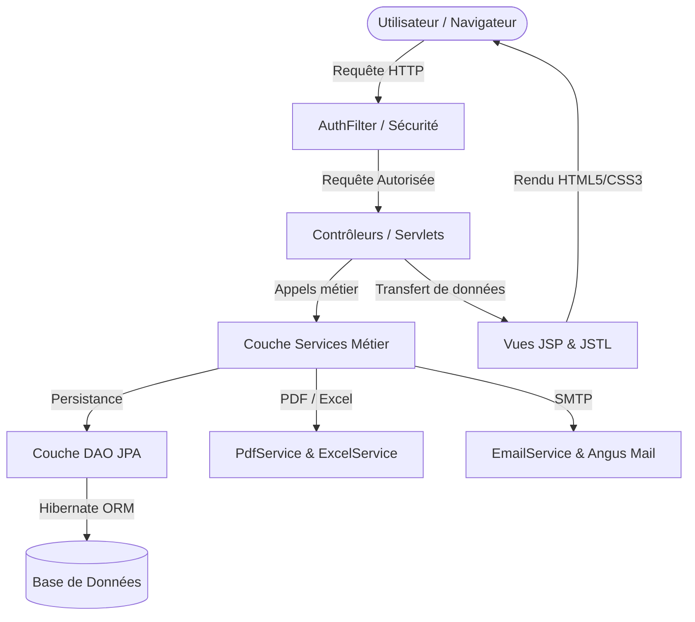
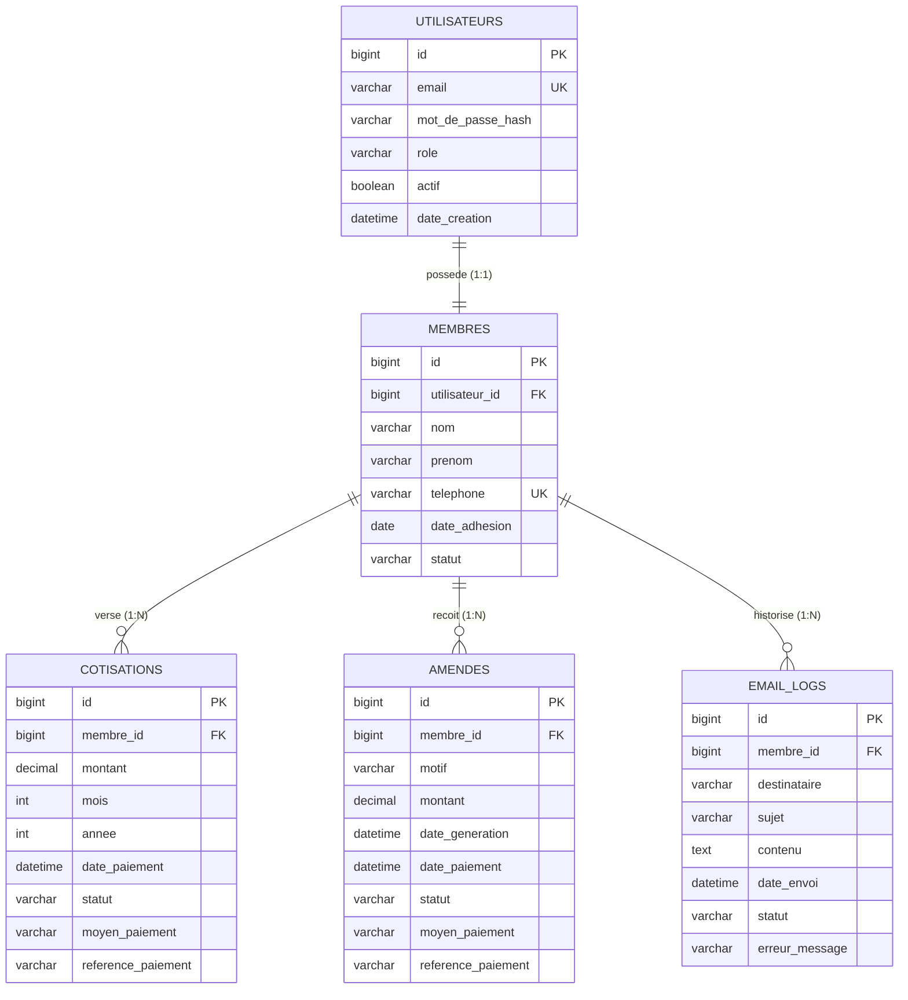

# 📋 Rapport Récapitulatif du Projet : Système de Gestion des Cotisations UCAD

---

## 📌 1. Présentation Générale du Projet

Le projet **Système de Gestion des Cotisations UCAD** est une application web d'entreprise moderne développée pour l'**Université Cheikh Anta Diop de Dakar (UCAD)**. Elle a pour vocation d'automatiser et de fiabiliser l'ensemble des processus de gestion des cotisations mensuelles, de calcul et de suivi des amendes de retard, de gestion des membres, ainsi que de reporting financier et d'envoi de notifications par e-mail.

### 🎯 Objectifs Principaux
- **Gestion centralisée des membres** (adhésion, profil, statut actif/inactif).
- **Génération automatique et suivi des cotisations mensuelles**.
- **Gestion des paiements multicanaux** (Espèces, Virement bancaire, Chèque, Mobile Money Wave / Orange Money).
- **Détection automatique des retards et application d'amendes**.
- **Édition de reçus et bilans PDF professionnels** avec l'identité visuelle de l'UCAD.
- **Exportation des données au format Excel (`.xlsx`)** avec mise en forme dynamique.
- **Système de notifications par e-mail (SMTP)** avec traçabilité des envois.
- **Sécurité et contrôle d'accès basé sur les rôles (RBAC)** : Espace Administrateur & Espace Membre.

---

## 🛠️ 2. Stack Technologique & Dépendances

L'application repose sur les standards **Jakarta EE 10** et l'écosystème Java moderne :

| Composant / Rôle | Technologie / Bibliothèque | Version |
| :--- | :--- | :--- |
| **Langage & Plateforme** | Java SE (JDK) | **17 (LTS)** |
| **Standard Entreprise** | Jakarta EE Web API (Servlet 6.0, JSP 3.1, JPA 3.1, CDI 4.0) | **10.0.0** |
| **ORM / Persistance** | Hibernate ORM | **6.4.4.Final** |
| **Injection de Dépendances** | JBoss Weld (Servlet Core CDI) | **5.1.2.Final** |
| **Bases de Données** | H2 Database (in-memory / dev) & MySQL Connector/J (prod) | **2.2.224 / 8.3.0** |
| **Moteur de Vues** | JSP 3.1 / Jakarta Standard Tag Library (JSTL) | **3.0.1** |
| **Sécurité & Hashage** | jBCrypt (Algorithme Blowfish sécurisé) | **0.4** |
| **Génération PDF** | OpenPDF (LibrePDF) | **1.3.39** |
| **Génération Excel** | Apache POI (poi-ooxml) | **5.2.5** |
| **Messagerie E-mail** | Jakarta Mail & Eclipse Angus Mail (SMTP/STARTTLS) | **2.1.3 / 2.0.3** |
| **Serveur d'application** | Apache Tomcat | **10.1+** |
| **Conteneurisation** | Docker (Multi-stage build) & Docker Compose | - |

---

## 🏗️ 3. Architecture Logicielle

Le projet est conçu selon le patron d'architecture **MVC (Modèle - Vue - Contrôleur)** en couches distinctes, garantissant une forte cohésion et un faible couplage :

```
sn.ucad.cotisations
 ├── config/        # Configuration centralisée & cycle de vie JPA
 ├── dao/           # Couche d'accès aux données (Data Access Object)
 ├── filter/        # Filtres HTTP de sécurité et contrôle d'accès
 ├── listener/      # Initialisation du contexte applicatif & bootstrap BDD
 ├── model/         # Entités JPA et Énumérations métier
 ├── service/       # Couche Métier (Logique d'affaires, PDF, Excel, Mail)
 └── servlet/       # Contrôleurs HTTP (Servlets Jakarta)
```



---

## 💾 4. Modèle de Données & Entités JPA

Le schéma relationnel est modélisé avec JPA 3.1 / Hibernate 6 et s'articule autour de 5 tables principales :



### Énumérations Définies :
- **`RoleEnum`** : `ADMIN`, `MEMBRE`.
- **`StatutMembre`** : `ACTIF`, `INACTIF`, `SUSPENDU`.
- **`StatutCotisation`** : `EN_ATTENTE`, `PAYEE`, `EN_RETARD`, `ANNULEE`.
- **`StatutAmende`** : `IMPAYEE`, `PAYEE`, `ANNULEE`.
- **`MoyenPaiement`** : `ESPECES`, `VIREMENT`, `CHEQUE`, `MOBILE_MONEY`.
- **`StatutNotification`** : `ENVOYE`, `ECHEC`.

---

## ⚙️ 5. Détail des Fonctionnalités Développées

### 🔐 1. Authentification, Sécurité & Sessions
- **Contrôle d'accès par filtre (`AuthFilter`)** : Protection de l'ensemble des routes (`/dashboard`, `/membres`, `/cotisations`, `/amendes`). Redirection automatique des utilisateurs non authentifiés vers `/login`.
- **Hachage BCrypt** : Tous les mots de passe sont hachés avec salt dynamique.
- **Initialisation automatique de l'administrateur (`AppInitializerListener`)** : Création automatique ou vérification/mise à jour du compte administrateur par défaut (`admin@ucad.sn` / `admin123`) dès le déploiement.
- **Isolation des rôles** :
  - **Administrateur** : Vue d'ensemble, gestion de tous les membres, génération de cotisations, application d'amendes, exports Excel globaux.
  - **Membre** : Consultation de son profil, historique de ses cotisations personnelles, amendes propres, téléchargement de ses reçus PDF.

---

### 👥 2. Module de Gestion des Membres (`MembreService`, `MembreServlet`)
- **CRUD Membre complet** :
  - Liste de tous les membres avec statut, téléphone et adresse e-mail.
  - Fiche détaillée du membre avec historique complet de ses cotisations et amendes.
  - Formulaire de création d'un membre (génère automatiquement son compte utilisateur lié).
  - Formulaire de modification des informations d'un membre.
  - Désactivation douce d'un membre (passage au statut `INACTIF`).
- **Export Excel de l'annuaire** : Téléchargement instantané d'un fichier `.xlsx` stylisé répertoriant tous les membres inscrits.

---

### 💰 3. Module de Gestion des Cotisations (`CotisationService`, `CotisationServlet`)
- **Génération mensuelle automatisée** : En un clic, l'administrateur peut générer les cotisations pour l'ensemble des membres actifs du mois sélectionné (avec protection contre les doublons).
- **Enregistrement des paiements** : Saisie du moyen de paiement (Espèces, Wave, Orange Money, etc.) et du numéro de transaction / référence.
- **Détection des retards & Facturation d'amendes** : Analyse des cotisations non réglées pour une période donnée, bascule vers le statut `EN_RETARD` et génération automatique d'une amende associée.
- **Reçus PDF Haute Fidélité (`PdfService`)** : Génération au format A5 d'un reçu officiel de paiement avec logo/charte UCAD, informations du membre, référence et statut certifié.
- **Export Excel des cotisations (`ExcelService`)** : Génération de tableaux comptables avec code couleur dynamique (vert pour payé, rouge pour retard).

---

### ⚠️ 4. Module de Gestion des Amendes (`AmendeService`, `AmendeServlet`)
- **Suivi des pénalités** : Liste complète des amendes émises (automatiques ou manuelles).
- **Création manuelle** : Possibilité pour l'administrateur d'émettre une amende forfaitaire avec un motif spécifique.
- **Règlement des amendes** : Processus d'encaissement similaire aux cotisations avec archivage de la référence de paiement.

---

### 📧 5. Système de Notifications & Audit E-mail (`EmailService`)
- **Envoi SMTP transactionnel** : Compatible Gmail SMTP, Mailtrap ou tout serveur SMTP institutionnel.
- **Templates HTML soignés** :
  - Reçu / Confirmation de paiement immédiat.
  - Avis de rappel pour cotisation en retard.
- **Audit & Journalisation (`EmailLogDao`)** : Chaque e-mail envoyé (ou échoué) est consigné en base de données avec date, sujet, destinataire et code d'erreur éventuel.

---

### 📊 6. Tableau de Bord & Indicateurs Clés (KPI) (`DashboardServlet`)
- **KPIs Financiers & Opérationnels en temps réel** :
  - Nombre total de membres actifs.
  - Montant global des cotisations encaissées (en FCFA).
  - Montant total des amendes en attente de recouvrement.
  - Nombre de cotisations en retard.
  - Nombre d'amendes impayées.
- **Flux d'activité récente** : Visualisation immédiate des 10 dernières transactions, 5 dernières amendes et des derniers e-mails expédiés.

---

## 🎨 7. Interface Utilisateur & Expérience Graphique (UI/UX)

- **Charte Graphique Institutionnelle** :
  - Couleur Primaire : Bleu Nuit UCAD (`#1a237e` / `#283593`).
  - Couleur d'Accent : Orange Vif (`#f57f17` / `#ffa000`).
  - Vert Succès (`#2e7d32`) et Rouge Alerte (`#c62828`).
- **Composants d'interface modernes** :
  - Sidebar fixe avec navigation hiérarchisée et badge utilisateur.
  - Topbar dynamique avec horodatage local en français.
  - Cartes KPI avec micro-interactions au survol (`hover lift effect`).
  - Tableaux avec badges d'état arrondis (`badge-success`, `badge-warning`, `badge-danger`).
  - Alertes flash dismissed automatiquement.
  - Pages d'erreurs conviviales (`404.jsp` et `500.jsp`).

---

## 📁 8. Inventaire Complet des Fichiers Développés

| Catégorie | Fichier | Rôle & Description |
| :--- | :--- | :--- |
| **Build & Config** | `pom.xml` | Descripteur Maven avec dépendances Jakarta EE 10, Hibernate, POI, OpenPDF, JSTL, BCrypt |
| | `Dockerfile` | Image Docker multi-stage (Maven 3.9 + Eclipse Temurin 17 -> Tomcat 10.1) |
| | `docker-compose.yml` | Définition du service conteneurisé prêt à tourner sur le port 8080 |
| | `application.properties` | Paramètres généraux : URL BDD, montants par défaut, devise FCFA, configuration SMTP |
| | `persistence.xml` | Configuration de l'unité de persistance JPA `CotisationPU` avec Hibernate 6 |
| | `beans.xml` | Activation du contexte CDI Jakarta dans Tomcat |
| | `web.xml` | Déclaration des listeners (`Weld`, `AppInitializer`), timeouts de session, pages d'erreurs |
| **SQL** | `schema.sql` | Script DDL complet de création des tables et index MySQL |
| | `data.sql` | Données d'initialisation (administrateur, membres de démonstration, cotisations d'exemple) |
| **Configuration Java** | `AppConfig.java` | Singleton de lecture dynamique du fichier `application.properties` |
| | `JpaUtil.java` | Gestionnaire de cycle de vie de l'`EntityManagerFactory` JPA |
| **Listener & Filtre** | `AppInitializerListener.java` | Bootstrap JPA & création automatique du compte `admin@ucad.sn` |
| | `AuthFilter.java` | Filtre de sécurité interceptant les accès non autorisés |
| **Modèles (JPA)** | `Utilisateur.java` | Entité compte utilisateur (email, password hashé, rôle) |
| | `Membre.java` | Entité profil membre (nom, prénom, téléphone, date d'adhésion, statut) |
| | `Cotisation.java` | Entité cotisation mensuelle (montant, mois, année, statut, paiement) |
| | `Amende.java` | Entité amende de retard (motif, montant, statut, paiement) |
| | `EmailLog.java` | Entité traçabilité des e-mails expédiés |
| | *Énumérations* | `RoleEnum`, `StatutMembre`, `StatutCotisation`, `StatutAmende`, `MoyenPaiement`, `StatutNotification` |
| **Couche DAO** | `UtilisateurDao.java` | Requêtes JPA sur les comptes utilisateurs (recherche par e-mail, etc.) |
| | `MembreDao.java` | Requêtes JPA membres (recherche actifs, téléphone, nom) |
| | `CotisationDao.java` | Requêtes JPA cotisations (sommes encaissées, filtres par période/membre) |
| | `AmendeDao.java` | Requêtes JPA amendes (total impayé, filtres par statut) |
| | `EmailLogDao.java` | Journalisation et historique des notifications |
| **Couche Services** | `AuthService.java` | Logique d'authentification, vérification BCrypt, gestion de session |
| | `MembreService.java` | Logique métier de gestion des membres |
| | `CotisationService.java` | Génération de lots, encaissement, détection automatique des retards |
| | `AmendeService.java` | Émission, calcul et encaissement des amendes |
| | `PdfService.java` | Génération de reçus A5 et bilans mensuels en PDF |
| | `ExcelService.java` | Export de classeurs `.xlsx` (Membres & Cotisations) via Apache POI |
| | `EmailService.java` | Composition et expédition d'e-mails HTML via SMTP |
| **Contrôleurs (Servlets)**| `LoginServlet.java` | Affichage du login et traitement de la connexion |
| | `LogoutServlet.java` | Invalidation de la session et déconnexion |
| | `DashboardServlet.java`| Agrégation des KPIs et routage du tableau de bord (Admin) |
| | `MembreServlet.java` | CRUD des membres, export Excel et envoi d'email de bienvenue |
| | `CotisationServlet.java`| Génération avec montant libre, paiement autonome, reçus PDF, exports Excel |
| | `AmendeServlet.java` | Gestion et règlement des amendes |
| | `ProfileServlet.java` | Consultation et mise à jour du profil et mot de passe |
| | `ChangerMotDePasseServlet.java` | Renouvellement autonome du mot de passe initial |
| **Vues JSP** | `header.jsp` & `footer.jsp` | Gabarit commun avec bithématisation Admin/Membre et palette claire |
| | `login.jsp` | Page de connexion moderne avec scroll vertical fluide |
| | `changer-mot-de-passe.jsp` | Page sécurisée de personnalisation du mot de passe |
| | `profile/index.jsp` | Page de gestion du profil personnel et mot de passe |
| | `dashboard/index.jsp` | Tableau de bord avec cartes KPI et actions rapides avec montant |
| | `membres/liste.jsp` | Table des membres avec recherche instantanée et actions |
| | `membres/formulaire.jsp`| Formulaire de création / modification d'un membre |
| | `membres/detail.jsp` | Fiche complète du membre avec son historique |
| | `cotisations/liste.jsp` | Suivi des cotisations avec filtre personnel et modal de génération |
| | `cotisations/paiement.jsp` | Formulaire d'encaissement d'une cotisation |
| | `amendes/liste.jsp` | Tableau de gestion des amendes et formulaire d'ajout |
| | `amendes/paiement.jsp` | Formulaire d'encaissement d'une amende |
| | `error/404.jsp` & `500.jsp`| Pages d'erreurs stylisées |

---

## 🚀 9. Guide de Démarrage Rapide

### Option 1 : Lancement avec Docker Compose (Recommandé)
```bash
docker compose up --build
```
L'application est immédiatement disponible sur : `http://localhost:8080/` (ou `http://localhost:8080/cotisations-app/`).

### Option 2 : Compilation Maven & Déploiement Tomcat
```bash
# Compilation et packaging du WAR
mvn clean package

# Déployer target/cotisations-app.war dans le dossier webapps/ de Tomcat 10.1+
```

### 🔑 Identifiants Administrateur par Défaut :
- **E-mail** : `admin@ucad.sn`
- **Mot de passe** : `admin123`

---

*Document généré automatiquement pour consigner l'ensemble des réalisations techniques, architecturales et fonctionnelles du projet.*
